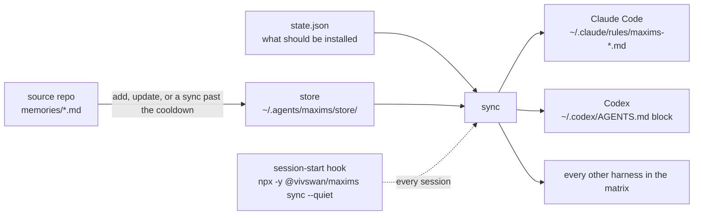

# maxims

maxims installs one-line rule memories from GitHub repos or local folders into the always-loaded instruction layer of every coding agent on a machine, and a small hook re-syncs them each time a session opens. These pages describe the behavior the code is built and tested against; each fact lives on one page.

```bash
npx -y @vivswan/maxims add @Vivswan/skills -g --rule --add-hook
```



[How it works](how-it-works.md) walks the picture stage by stage. The pages below are grouped by what you are trying to do.

| I want to... | Read |
| --- | --- |
| install a source and see what lands on disk | [Quickstart](quickstart.md) |
| follow a rule from the source repo to the agent's context | [How it works](how-it-works.md) |
| choose a scope, a selection, or a harness, or resolve a name collision | [Install a source](install.md) |
| commit a source list a fresh clone replays | [Share rules with your team](share.md) |
| know what the session hook does, and when a source is refetched | [Keep rules fresh](keep-fresh.md) |
| look at upstream changes before they reach an agent | [Keep rules fresh](keep-fresh.md#hold-changes-for-review) |
| write a memory file maxims accepts, scaffold one, lint a folder | [Write your own memories](write-memories.md) |
| check what each harness loads, in a terminal or in CI | [Check an install](check.md) |
| fix what a session start or a sync reports | [When something breaks](troubleshooting.md) |
| remove a source, move to a new machine, or uninstall | [Move, back up, or uninstall](move-or-uninstall.md) |
| look up a verb, a flag, or an exit code | [CLI reference](cli.md) |
| know which agents are supported and what each one gets | [Harnesses](harnesses.md) |
| know what lives in the maxims home and what `config.json` holds | [Files on disk](files.md) |
| know what state records and how it migrates | [State](state.md) |
| know what a failure keeps, and what two processes at once do | [What sync guarantees](guarantees.md) |
| compare the flags and verbs with `npx skills` | [Parity with npx skills](parity.md) |
| declare a harness as data, built in or in `harnesses.json` | [Adding a harness](adding-a-harness.md) |
| understand the problem, and what came before | [Why maxims](why.md) |
| know why a behavior is the way it is | [Design decisions](design-decisions.md) |
| read the threat model | [Security](security.md) |
| see how the code is arranged, file by file, and who writes what | [Architecture](architecture.md) |
