# Architecture

How maxims is arranged on disk and in code: what lives where, who writes it, and how a memory travels from a source to a rule line, one diagram per concept. The checks behind the page prove existence only: every path a box names exists, every symbol after a path is exported by that file, and every `Demonstrated by:` link resolves. No check tests the claim a diagram makes.

A cylinder is a file or directory on this machine, a double-edged box is a process, and a plain box is code, named by its file and the exported symbols it means.

The sections follow the path a byte takes: disk, then intent, then a fetched source, then the rendered rule line, then the harness that receives it, then the write itself, then the hook that starts the next run. The verb flows follow, one per command as the command line runs it, and the module map closes the page.

## What lives on disk

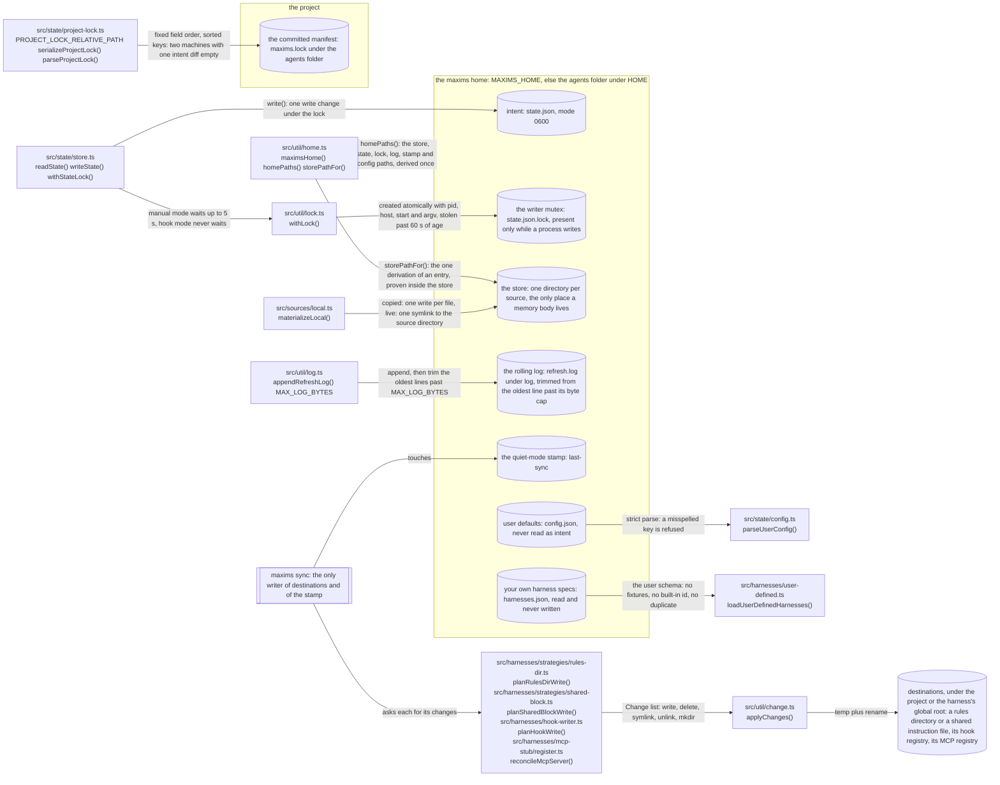

- **Every destination has one writer.** `add`, `update` and `remove` change `state.json` and then run `sync`; no verb has a private path to a rules directory, an instruction file or a registry.
- The [canonical home](files.md#the-canonical-home) owns the tree, why it sits inside the agents folder, every naming rule of the store, and which two files are not state.

Demonstrated by: [src/util/home.test.ts](../src/util/home.test.ts), [src/state/store.test.ts](../src/state/store.test.ts), [src/util/log.test.ts](../src/util/log.test.ts), [src/state/project-lock.test.ts](../src/state/project-lock.test.ts).

## State is intent, everything else is derived

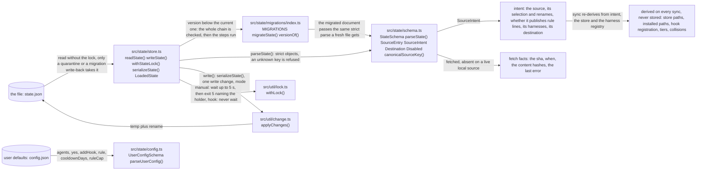

- **A quarantine or a write-back acts only on bytes read under the lock.** A lock-free read that finds a corrupt or migratable file inspects it again under the lock, or reports what it saw when another process holds it.
- **A live local source has no `fetched` member at all,** so nothing downstream checks for one; the remote and copied-local variants differ only in what their sha is, a git commit or a content hash.
- The [state page](state.md#state-holds-intent-never-actuality) owns the table of what belongs in the file and what its real owner is.

Demonstrated by: [src/state/store.test.ts](../src/state/store.test.ts), [src/state/schema.test.ts](../src/state/schema.test.ts), [src/state/migrations/index.test.ts](../src/state/migrations/index.test.ts), [src/state/config.test.ts](../src/state/config.test.ts).

## A source becomes memories

```mermaid
flowchart LR
  from["src/state/schema.ts<br>SourceFrom DEFAULT_GIT_REF"]
  contract["src/sources/contract.ts<br>SourceResolver FetchOptions FetchResult"]
  github["src/sources/github/index.ts<br>createGithubResolver() needsFetch()"]
  ladder["src/sources/github/ladder.ts<br>createLadder() climb() lsRemoteRung() cloneRung() endpointsFor() tokenFor()"]
  tarball["src/sources/github/tarball.ts<br>extractTarball()"]
  git["src/sources/git/index.ts<br>createGitResolver()"]
  local["src/sources/local.ts<br>createLocalResolver() materializeLocal()"]
  temp[("the fetch's temporary directory")]
  tree["src/sources/tree.ts<br>readMemoryTree() hashFiles()"]
  memory["src/memory/contract.ts<br>parseMemory() parseMemoryName() hiddenCharacters() contentHashOf() RESERVED_FILES"]
  wikilinks["src/memory/wikilinks.ts<br>extractWikilinks() resolveWikilinks()"]
  home["src/util/home.ts<br>storePathFor()"]
  storedir[("the store entry, one directory per source")]
  from -->|"type github, git or local picks the resolver"| contract
  contract --> github
  contract --> git
  contract --> local
  github -->|"resolveRef(): with --auth gh api first, then git ls-remote, the REST sha as the fallback"| ladder
  github -->|"fetchTree(): with --auth a gh tarball first, then a shallow clone, sparse to the memory path unless it is the root or --full-depth is set, then the host's archive URL as the fallback"| ladder
  ladder -->|"a fallback rung runs only when git was absent or failed for a reason a second transport can fix"| tarball
  git -->|"ls-remote and clone with the URL exactly as written, no tarball, no GitHub token"| ladder
  ladder -->|"the tree at the sha"| temp
  tarball -->|"the archive's top folder dropped"| temp
  temp --> tree
  local -->|"the directory itself"| tree
  tree -->|"the .md files under the memory path, or the whole tree under --full-depth; hidden entries, symlinks and MEMORY.md skipped; relPath from the source root"| memory
  memory -->|"body"| wikilinks
  from --> home
  home -->|"the one derivation, proven inside the store"| storedir
  local -->|"copied: one write per file, live: one symlink"| storedir
```

- **A GitHub source is anonymous by default.** Without `--auth` no `gh` command runs and no GitHub token leaves the process; with it, `gh auth status` is asked once per host and the token rides as a bearer header. Another git remote uses git's own credential helpers either way; [How a source is fetched](keep-fresh.md#how-a-source-is-fetched) owns the user-facing table.
- **Nothing under `src/sources/` writes a remote source into the store.** A remote fetch lands in the temporary directory and returns its files in memory, so a fetch that fails on every rung leaves the previous store entry untouched: the last good copy the [failure paths](guarantees.md#failure-paths) promise.
- **A rung may only end in an outcome.** Whatever a rung throws becomes that rung's failure, and when every rung fails the most actionable failure wins: rate limit, then auth, missing, invalid, network.
- **The memory contract reports, the caller refuses.** `parseMemory()` returns a reason instead of throwing, and `hiddenCharacters()` lists what renders as nothing; [memory files](write-memories.md#the-contract) owns what is refused and why.

Demonstrated by: [src/sources/github/ladder.test.ts](../src/sources/github/ladder.test.ts), [src/sources/github/index.test.ts](../src/sources/github/index.test.ts), [src/sources/git/index.test.ts](../src/sources/git/index.test.ts), [src/sources/local.test.ts](../src/sources/local.test.ts), [src/sources/tree.test.ts](../src/sources/tree.test.ts), [src/memory/contract.test.ts](../src/memory/contract.test.ts), [src/memory/wikilinks.test.ts](../src/memory/wikilinks.test.ts).

## Memories become rule lines

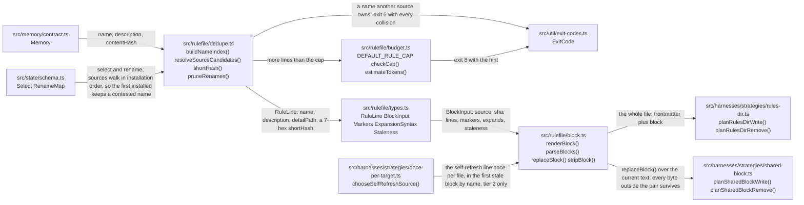

The block `renderBlock()` produces for two rule lines under stripped markers, as [src/rulefile/block.test.ts](../src/rulefile/block.test.ts) pins it:

```text
<!-- maxims:begin @Vivswan/skills sha=3f2a9c1e -->
<!-- managed by maxims: @Vivswan/skills - edits will be overwritten -->
<!-- update: npx -y @vivswan/maxims add @Vivswan/skills | remove: npx -y @vivswan/maxims remove @Vivswan/skills -->
- Codex rubber-duck review before EVERY commit, however trivial (detail: /home/user/.agents/maxims/store/Vivswan/skills/rubber-duck-before-every-commit.md, a1b2c3d)
- Landings are exit-conditioned: read the gate's own verdict, stop, merge in a separate command (detail: /home/user/.agents/maxims/store/Vivswan/skills/gate-exit-conditions-the-merge.md, 0f0f0f0)
<!-- maxims:end @Vivswan/skills -->
```

- **A BEGIN pairs only with the very next marker line,** and only when that line is its own END; an orphaned BEGIN is plain text, never a span that swallows the user's lines and a later valid block.
- **Appending closes what the user's text left open.** A fence, comment or raw HTML block still open at the end of the file gets the closer its kind has, or the blank line alone when a block tag needs none; otherwise the fence would swallow the markers and every later sync would append again.
- **Escaping follows the harness's `expands` list,** and the [rule file](harnesses.md#the-rule-file) owns the table of what is escaped and why.

Demonstrated by: [src/rulefile/block.test.ts](../src/rulefile/block.test.ts), [src/rulefile/dedupe.test.ts](../src/rulefile/dedupe.test.ts), [src/rulefile/budget.test.ts](../src/rulefile/budget.test.ts), [src/harnesses/strategies/once-per-target.test.ts](../src/harnesses/strategies/once-per-target.test.ts), [src/harnesses/strategies/shared-block.test.ts](../src/harnesses/strategies/shared-block.test.ts).

## A harness is a declaration plus quirks

```mermaid
flowchart LR
  specfile["src/harnesses/codex/spec.ts<br>spec"]
  quirks["src/harnesses/codex/quirks.ts<br>layeredHooksProbe()"]
  folder["src/harnesses/codex/index.ts<br>codex"]
  schema["src/harnesses/spec.ts<br>HarnessSpecSchema UserHarnessSpecSchema parseHarnessSpec()"]
  fromspec["src/harnesses/from-spec.ts<br>toDefinition() HarnessQuirks"]
  detect["src/harnesses/detect.ts<br>configDirExists()"]
  contract["src/harnesses/contract.ts<br>HarnessDefinition Target HookShape HookStdout scopeRoot() HARNESS_IDS"]
  registry["src/harnesses/registry.ts<br>HARNESSES"]
  userfile[("your own harness specs: harnesses.json")]
  userdef["src/harnesses/user-defined.ts<br>loadUserDefinedHarnesses()"]
  rulesdir["src/harnesses/strategies/rules-dir.ts<br>planRulesDirWrite() rulesDirPath()"]
  shared["src/harnesses/strategies/shared-block.ts<br>planSharedBlockWrite() sharedBlockPath()"]
  hook["src/harnesses/hook-writer.ts<br>planHookWrite() achievedTier()"]
  specfile -->|"satisfies HarnessSpec: paths relative to the scope root, a hook as a template"| folder
  quirks -->|"achievedTier: the project config read over the user one, which one file per scope cannot say"| folder
  folder -->|"toDefinition(spec, quirks)"| fromspec
  userfile -->|"parsed with UserHarnessSpecSchema"| userdef
  userdef --> schema
  schema --> fromspec
  fromspec -->|"every relative path joined under scopeRoot()"| contract
  fromspec -->|"detect.dirs become probes under the global root"| detect
  folder --> registry
  registry -->|"one HarnessDefinition per folder, a static import list"| contract
  contract -->|"targets of kind rules-dir"| rulesdir
  contract -->|"targets of kind shared-block"| shared
  contract -->|"hook of kind registry, file, custom or none"| hook
```

- **Writing logic lives once.** Two strategies and one hook writer serve every folder; a folder is data, and the three quirk kinds a spec cannot carry are a tier probe (codex), a config edit (opencode) and a custom reconcile (dsh). [Adding a harness](adding-a-harness.md) owns the spec, field by field.
- **A custom `reconcile` quirk needs hook kind `none` in the spec;** `toDefinition()` throws otherwise, so a folder cannot declare a registry hook and then replace it in code.
- **The registry is guarded by a completeness test:** a folder missing from the import list fails it, and a user spec that names a built-in id or repeats one is refused with the entry named.

Demonstrated by: [src/harnesses/from-spec.test.ts](../src/harnesses/from-spec.test.ts), [src/harnesses/contract.test.ts](../src/harnesses/contract.test.ts), [src/harnesses/registry.test.ts](../src/harnesses/registry.test.ts), [src/harnesses/user-defined.test.ts](../src/harnesses/user-defined.test.ts), [src/harnesses/conformance.test.ts](../src/harnesses/conformance.test.ts), [src/harnesses/codex/index.test.ts](../src/harnesses/codex/index.test.ts).

## Every write is a planned change

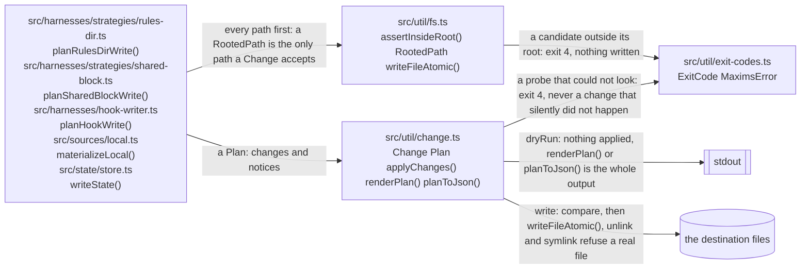

- **A `write` compares before it writes,** so an unchanged file keeps its bytes and its mtime, and a sync that changes nothing touches no destination.
- **`unlink` and `symlink` refuse a real file or directory at the path,** so the only thing a link change replaces is a link maxims could have written itself; a repointed link is created beside the old one and renamed over it, so no reader sees it absent.
- **Containment is judged on real paths.** `assertInsideRoot()` resolves the existing prefix of both root and candidate, so a rules directory symlinked out of the project fails while a root that is itself a symlink passes.

Demonstrated by: [src/util/change.test.ts](../src/util/change.test.ts), [src/util/fs.test.ts](../src/util/fs.test.ts), [src/util/lock.test.ts](../src/util/lock.test.ts).

## The hook path

```mermaid
flowchart LR
  contract["src/harnesses/contract.ts<br>HOOK_COMMAND HOOK_COMMAND_PREFIX HOOK_TIMEOUT_SECONDS hookSpecFor() HookShape HookStdout"]
  writer["src/harnesses/hook-writer.ts<br>planHookWrite() planHookRegistryWrite() planFileHookWrite() achievedTier()"]
  mcp["src/harnesses/mcp-stub/register.ts<br>MCP_SERVER_ENTRY reconcileMcpServer()<br>src/harnesses/mcp-stub/server.ts<br>serveMcpStub()"]
  registry[("the harness's own registry: a hooks file, a settings file or a hook script; a TOML config is read for the tier check and never written")]
  session[["a session starts, or a prompt is sent where the harness has no session-start event"]]
  sync[["maxims sync --quiet, the command every hook runs"]]
  home["src/util/home.ts<br>homePaths()"]
  stamp[("the quiet-mode stamp: last-sync")]
  store["src/state/store.ts<br>withStateLock() HookLockOutcome"]
  log["src/util/log.ts<br>appendRefreshLog()"]
  contract -->|"one HookSpec: the command, 20 s, async where the shape allows"| writer
  writer -->|"found by HOOK_COMMAND_PREFIX, so a later flag change replaces the entry it wrote"| registry
  mcp -->|"a harness with MCP but no hooks: a zero-tool server whose start runs the sync"| registry
  registry -->|"the event the spec names: SessionStart on most, pre_user_prompt on Windsurf, or the MCP handshake"| session
  session --> sync
  sync --> home
  home -->|"a stamp younger than 60 s: exit 0 without work"| stamp
  sync -->|"mode hook: a held lock is skipped, never waited on"| store
  sync -->|"what changed, one line per run"| log
```

- **The command carries no source, no filter and no version pin:** intent supplies the first two, and the missing pin lets a fix reach hooked sessions without a re-add.
- **Hook mode turns a held lock into a `skipped` outcome instead of exit 5,** the first half of the promise that a broken hook never breaks a session start. [One hook refreshes every harness](keep-fresh.md#one-hook-refreshes-every-harness) owns the tier story and the debounce.

Demonstrated by: [src/harnesses/hook-writer.test.ts](../src/harnesses/hook-writer.test.ts), [src/harnesses/conformance.test.ts](../src/harnesses/conformance.test.ts), [src/harnesses/mcp-stub/server.test.ts](../src/harnesses/mcp-stub/server.test.ts), [src/harnesses/mcp-stub/register.test.ts](../src/harnesses/mcp-stub/register.test.ts), [src/state/store.test.ts](../src/state/store.test.ts).

## A verb runs: add

```mermaid
flowchart LR
  bin[["maxims add: the bin entry hands real streams and an engine loader to main"]]
  main["src/commands/main.ts<br>main() CliDeps"]
  options["src/commands/shared/options.ts<br>parseVerbArgs() GLOBAL_FLAGS FLAGS parseDestination() parseSelect() parseAgents()"]
  engine["src/commands/engine.ts<br>createEngine()<br>src/commands/shared/resolvers.ts<br>createResolvers()"]
  console["src/console/mode.ts<br>consoleMode()<br>src/console/contract.ts<br>createConsole() promptsAllowed()"]
  add["src/commands/add.ts<br>add parseAddRequest() stageAdd() provenanceFor() showProvenance() planAdd()"]
  temp[("the fetch's temporary directory, removed on every path")]
  intent["src/commands/shared/cli-context.ts<br>loadIntentFor() peekIntent()"]
  commit["src/commands/add.ts<br>commitAdd() admitIntent()"]
  update["src/commands/shared/cli-context.ts<br>updateIntent()<br>src/state/store.ts<br>withStateLock()"]
  riders["src/commands/shared/fetch.ts<br>swapStoreEntry()<br>src/sources/local.ts<br>materializeLocal()<br>src/commands/shared/project-lock-io.ts<br>projectLockChange()<br>src/commands/shared/cli-context.ts<br>configWrite()"]
  apply["src/util/change.ts<br>applyChanges()"]
  written[("intent: state.json, the store entry, config.json, the manifest")]
  after["src/commands/add.ts<br>syncCommitted()<br>src/commands/shared/engine-io.ts<br>framed()<br>src/commands/sync.ts<br>runSync()"]
  finish["src/commands/shared/output.ts<br>finish() mergePlans()"]
  bin --> main
  main -->|"-h, -v, --quiet, --json and --dry-run are read off argv before any verb module loads"| options
  main -->|"loaded once a verb is about to run, never for help, the version or an unknown verb"| engine
  main -->|"openConsole(yes): -y, --all or config yes; a prompt needs a TTY on both ends and no agent"| console
  options --> add
  add -->|"step 1: the resolver fetches at the pin"| temp
  add -->|"step 2: the intent as it is; lock-free under --list and --dry-run"| intent
  add -->|"steps 3 and 4: hidden characters, wikilinks, the collision walk, the harness choice, the confirm"| commit
  commit -->|"steps 5 and 6: one function, under the lock on a real run; a dry run plans the same write lock-free"| update
  update -->|"the store swap or the local link, the lock projection, the config, in the same plan"| riders
  update -->|"admitIntent(): the sync planned dry against the state about to land; a refusal writes nothing"| apply
  riders --> apply
  apply -->|"the riders first; state.json last, mode 0600"| written
  commit -->|"fetch none: the commit just fetched; the engine's own lines go nowhere, its report is what is shown"| after
  after -->|"the verb's lines, the plan under --dry-run, one document under --json"| finish
```

- **One commit point.** Steps 1 to 4 write nothing, so a failure there (exit 2, 3, 6, 7 or 8) leaves the machine as it was, apart from a corrupt state file the locking read has already moved aside; steps 5 and 6 are one state write with the store swap, the manifest and the config in the same plan, and then the sync every other verb ends in runs.
- **`-y` changes the console, not the flow.** The same code runs; `promptsAllowed()` is false, so the confirm answers its silent default and the harness prompt falls back to the remembered answer. `--json` needs `-y` or `--all`, since a prompt would break the one document.
- **The harness choice has an order:** `-a` as typed (every harness with a target under `--all`), else the harnesses detected on this machine, else `config.agents`, else a prompt pre-filled with the last answer. A harness with no target at the destination's scope is skipped: with a warning when it was named, detected or config-listed, silently under `--all` or `-a '*'`, and the prompt never offers it.
- **`--list` stops before validation,** so a source whose install would be refused can still be seen and narrowed; it fetches unless `--no-fetch` walks the store copy, and it never writes.

Demonstrated by: [tests/cli/add.test.ts](../tests/cli/add.test.ts), [tests/cli/parser.test.ts](../tests/cli/parser.test.ts), [tests/console/golden.test.ts](../tests/console/golden.test.ts).

## A verb runs: sync

```mermaid
flowchart LR
  verb["src/commands/engine-verbs.ts<br>sync"]
  persist["src/commands/shared/cli-context.ts<br>cooldownCapConfig() persistConfig()"]
  io["src/commands/shared/engine-io.ts<br>engineIo() exitForFailed()"]
  runsync["src/commands/sync.ts<br>runSync()"]
  context["src/commands/shared/context.ts<br>loadContext() findProjectRoot() EngineContext"]
  preview["src/commands/shared/report.ts<br>previewState()"]
  lock["src/commands/shared/debounce.ts<br>stampLastSync()<br>src/state/store.ts<br>withStateLock()"]
  plan["src/commands/shared/engine.ts<br>planSync() SyncOutcome SyncExtras"]
  refresh["src/commands/shared/fetch.ts<br>refreshSource() isDue() FAILED_FETCH_RETRY_MS"]
  select["src/commands/shared/select.ts<br>selectMemories() disabledNames()<br>src/rulefile/dedupe.ts<br>buildNameIndex() resolveSourceCandidates()"]
  writers["src/commands/shared/bodies.ts<br>planBodies() planBodySweep()<br>src/commands/shared/rules.ts<br>planRuleFile() planRulesDirSweep()<br>src/commands/shared/hooks.ts<br>planHooks()<br>src/commands/shared/orphans.ts<br>planOrphanSweep()"]
  builder["src/commands/shared/plan.ts<br>PlanBuilder ChangeCategory<br>src/commands/shared/notices.ts<br>Notices"]
  finish["src/commands/shared/report.ts<br>finishSync() summaryLine()"]
  apply["src/util/change.ts<br>applyChanges()"]
  log["src/util/log.ts<br>appendRefreshLog()"]
  disk[("destinations, the store, state.json, the log")]
  verb -->|"--cooldown and --cap land in config.json before the engine runs; a dry run writes nothing and hands the engine the new values as a preview"| persist
  verb -->|"fetch due, or none under --no-fetch or when -a names harnesses; -a narrows the run"| io
  io --> runsync
  runsync -->|"stdin never read: the invoker is a person and the project root is the cwd's"| context
  runsync -->|"--dry-run: read lock-free, quarantine nothing, print the plan"| preview
  runsync -->|"the stamp, then manual mode: wait up to 5 s, then exit 5 naming the holder"| lock
  lock -->|"lock.read(): a quarantine or migration happens here; an unusable file is one line and exit 0"| plan
  preview --> plan
  plan -->|"step 2: every fetched source that acts here, due by cooldown or forced by update"| refresh
  plan -->|"step 3: disabled names out, installed names first; a collision or the cap refuses the source whole"| select
  plan -->|"steps 4 and 5: bodies, blocks compared against the file, hooks, the sweeps"| writers
  writers --> builder
  builder -->|"the state write only when the state changed"| finish
  finish --> apply
  apply --> disk
  finish -->|"refreshed keys, every change, the trace lines"| log
  finish -->|"the first failure, printed, then ReportedMaximsError; failed sources map to exit 2 or 3"| io
```

- **A refused fresh refresh is rolled back.** `planSync()` loops: the source's last-good copy is restored and the whole installation is planned again from it, so what the retained rules point at is what the name index and the sweeps see. The refusal's own lines are carried over once.
- **A failed fetch is a report, not a stop.** The other sources land; the failure is logged, shown at once when the source is gone or its content invalid, otherwise once the source counts as stale; and the verb exits 2, or 3 when every failure is a source with nothing valid to install.

Demonstrated by: [src/commands/sync.test.ts](../src/commands/sync.test.ts), [tests/cli/verbs.test.ts](../tests/cli/verbs.test.ts).

## A hook runs: sync --quiet

```mermaid
flowchart LR
  hook[["the harness's hook: maxims sync --quiet, the event payload on stdin"]]
  main["src/commands/main.ts<br>main()"]
  runsync["src/commands/sync.ts<br>runSync()"]
  stdin["src/commands/shared/stdin.ts<br>readHookStdin() classifyInvoker() stdoutVariantFor() HOOK_STDIN_FIRST_CHUNK_MS"]
  context["src/commands/shared/context.ts<br>loadContext()"]
  debounce["src/commands/shared/debounce.ts<br>isDebounced() stampLastSync() QUIET_DEBOUNCE_MS"]
  stamp[("the quiet-mode stamp: last-sync")]
  lock["src/state/store.ts<br>withStateLock() HookLockOutcome"]
  plan["src/commands/shared/engine.ts<br>planSync()"]
  builder["src/commands/shared/plan.ts<br>PlanBuilder"]
  finish["src/commands/shared/report.ts<br>finishSync() EMPTY_REPORT"]
  render["src/commands/shared/stdin.ts<br>renderHookStdout()"]
  log["src/util/log.ts<br>appendRefreshLog()"]
  session[["the session that started: stdout in the harness's protocol, exit 0 always"]]
  hook -->|"--quiet is read off argv first: a usage error is one log line and exit 0"| main
  main --> runsync
  runsync -->|"a TTY is never read; a pipe gets 200 ms for the first chunk, 1 s in all, or until one JSON value parses"| stdin
  stdin -->|"the field only that harness sends names it; the project root is found from its cwd; unknown JSON means silence"| context
  runsync -->|"a stamp younger than 60 s: exit 0 before state is read"| debounce
  debounce -->|"written before the lock, best effort"| stamp
  runsync -->|"hook mode never waits: held means one log line and exit 0"| lock
  lock -->|"an unusable state file: one log line, nothing emptied"| plan
  plan -->|"deferDeletions: removals, orphans and every delete outside the store swap wait for an interactive run"| builder
  builder --> finish
  finish -->|"a write that fails is one loud notice; every earlier change stays applied"| render
  finish --> log
  render -->|"nothing to say prints nothing, whatever the envelope"| session
  runsync -->|"whatever else is thrown: the stack goes to the log, the report is empty"| log
```

- **A hook run may not take anything away,** since a partial read must never empty a machine; `PlanBuilder.build()` holds back the deferred categories whole.
- **One stamp debounces every hook on the machine,** since each runs the same command; an interactive run is never debounced but writes the stamp too.
- **Notices reach the session only in its protocol.** `stdoutVariantFor()` reads the definition's declared stdout shape; a harness this build does not know gets silence, since plain text into a JSON-only reader is a hook error at every session start.

Demonstrated by: [src/commands/sync-failsoft.test.ts](../src/commands/sync-failsoft.test.ts), [src/commands/shared/stdin.test.ts](../src/commands/shared/stdin.test.ts), [tests/cli/verbs.test.ts](../tests/cli/verbs.test.ts).

## A verb runs: remove

```mermaid
flowchart LR
  verb["src/commands/engine-verbs.ts<br>remove removeOptions()"]
  options["src/commands/shared/options.ts<br>parseDestination() parseSelect() parseAgents()"]
  lookup["src/commands/shared/sources.ts<br>lookupSource() resolveMemoryName() installedElsewhere()"]
  console["src/console/contract.ts<br>promptsAllowed()<br>src/console/strings.ts<br>STRINGS"]
  runremove["src/commands/remove.ts<br>runRemove()"]
  lock["src/state/store.ts<br>withStateLock()<br>src/commands/shared/report.ts<br>previewState()"]
  installed["src/commands/shared/engine.ts<br>readInstalledTree() retainedNames()<br>src/commands/shared/select.ts<br>selectMemories()"]
  lockio["src/commands/shared/project-lock-io.ts<br>projectLockChange()"]
  plan["src/commands/shared/engine.ts<br>planSync() SyncExtras"]
  sweeps["src/commands/shared/rules.ts<br>planRuleFile() planRulesDirSweep() claimedByMaxims()<br>src/commands/shared/bodies.ts<br>planBodySweep()<br>src/commands/shared/hooks.ts<br>planHooks()"]
  finish["src/commands/shared/report.ts<br>finishSync()"]
  disk[("rule files, body links and copies, the store entry, registries, the manifest, state.json")]
  verb -->|"one target: every source that acts here under --all, a source key, or memories of one source"| options
  options -->|"a source first; a bare name when no recorded source answers; another project's is refused"| lookup
  verb -->|"without -y or --all: a confirm on a terminal; anywhere else exit 1 before the engine"| console
  lookup --> runremove
  runremove -->|"manual mode; a dry run reads lock-free and settles nothing"| lock
  lock -->|"the installed picture: the tree, or the names its retained blocks still hold"| installed
  installed -->|"a * selection becomes the explicit rest, so a refresh cannot bring the memory back"| plan
  runremove -->|"a project entry changed: this machine's lock entries rewritten, a teammate's kept"| lockio
  lockio --> plan
  plan -->|"verb remove, fetch none: the same convergence that installs, with the entry gone"| sweeps
  sweeps -->|"deletions apply even under --quiet; only the sync verb defers them"| finish
  finish --> disk
```

- **There is no unsync path.** The entry leaves intent and the same convergence removes what no intent derives: a file is ours to delete only while it carries a managed block, a rules directory holding nothing but such files goes with them, and a hook is wanted at a scope only while a source there lists its harness.
- **`-a` on a source drops that harness's artifacts and keeps the entry while another harness remains;** on a memory or a narrowed selection it is refused, since a memory has no per-harness half.
- **A bare name two sources provide is refused** with both qualified forms and no change; a name nobody provides is a usage error before the engine runs.

Demonstrated by: [src/commands/remove.test.ts](../src/commands/remove.test.ts), [tests/cli/verbs.test.ts](../tests/cli/verbs.test.ts).

## Two read-only verbs: list and doctor

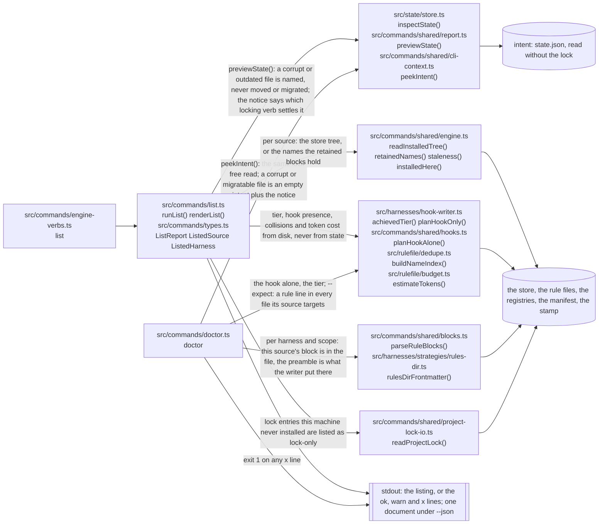

- **`list` reports what state asks for,** with everything past intent re-derived on the spot: a hook the user deleted reads absent, a tier the config demoted reads 2, a rename whose collision is gone reads unneeded.
- **`doctor` goes file by file.** A rule file counts as present only when the engine's own parser finds this source's block in it; each `x` line is one thing a harness will not load as state asks (a block, a preamble, a hook, an `--expect` name), and `--expect` is the CI assertion.

Demonstrated by: [src/commands/list.test.ts](../src/commands/list.test.ts), [tests/cli/verbs.test.ts](../tests/cli/verbs.test.ts), [src/state/store.test.ts](../src/state/store.test.ts).

## The lock projection: add --share, share and unshare

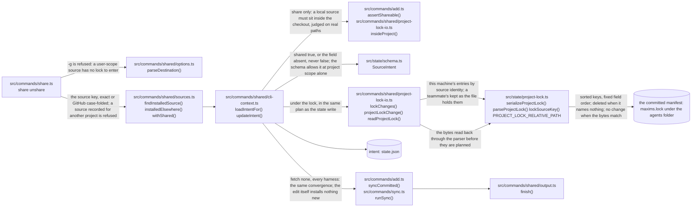

- **The lock is a projection of intent, never a second store.** `shared` is one field of a project-scope entry; every verb that edits a project entry's intent (`add --share`, `share`, `unshare`, `remove`, `link`, `update`, `disable`) recomputes the file from state through `projectLockChange()`, and `sync` never writes it.
- **This machine edits only its own entries,** because a clone that has not replayed the lock holds none of the team's entries in state; a teammate's disabled names are kept with their entries.
- **Of the project's disabled names, the lock carries those a shared source provides;** a private source providing a name a teammate switched off says nothing about the teammate's choice.

Demonstrated by: [tests/cli/add.test.ts](../tests/cli/add.test.ts), [src/commands/shared/select.test.ts](../src/commands/shared/select.test.ts), [src/state/project-lock.test.ts](../src/state/project-lock.test.ts).

## A verb runs: install

```mermaid
flowchart LR
  manifest[("the committed manifest: maxims.lock under the agents folder")]
  lockio["src/commands/shared/project-lock-io.ts<br>readProjectLock() projectLockPath() sourceFromLock()"]
  plock["src/state/project-lock.ts<br>ProjectLockSchema parseProjectLock()"]
  install["src/commands/install.ts<br>install"]
  stage["src/commands/add.ts<br>stageAdd() hookWanted()"]
  plan["src/commands/add.ts<br>planAdd()"]
  wikilinks["src/memory/wikilinks.ts<br>resolveWikilinks()"]
  commit["src/commands/add.ts<br>commitAdd()<br>src/commands/shared/cli-context.ts<br>updateIntent() withDisabled()"]
  statefile[("intent: state.json and the store entries")]
  after["src/commands/add.ts<br>syncCommitted()<br>src/commands/sync.ts<br>runSync()"]
  finish["src/commands/shared/output.ts<br>finish() mergePlans()"]
  manifest --> lockio
  lockio -->|"a shape error, an entry leaving the checkout, or two entries naming one source stops the replay whole"| plock
  plock --> install
  install -->|"every entry staged first: fetched and scanned, project scope, shared, the pin as the ref"| stage
  stage -->|"then planned against its siblings' names; a rename answered at one prompt binds the next"| plan
  plan -->|"the batch once more: distinct local names and every wikilink met, before anything is written"| wikilinks
  wikilinks --> commit
  commit -->|"one write: every entry plus the manifest's disabled names as project-scope disables; the manifest is not rewritten"| statefile
  commit -->|"one sync, reaching every harness the entries list; every harness when a disable landed"| after
  after --> finish
```

- **The batch lands whole or not at all.** A declined or refused entry stops before the write, so the machine gains nothing and the manifest is untouched, apart from a corrupt state file the locking read has already moved aside.
- **The manifest is input here, never output.** The lock is how a fresh clone learns what to add, and state stays the only thing `sync` reads: `sync` never installs from the lock; once state exists it prints one notice naming the lock-only sources and says to run `install`.
- **Replayed entries are `shared`,** so the machine that installed from the lock writes the same entries back when it edits them; a field the lock omits is recorded at `add`'s default.

Demonstrated by: [tests/cli/verbs.test.ts](../tests/cli/verbs.test.ts), [src/state/project-lock.test.ts](../src/state/project-lock.test.ts).

## The module map

Each node is one layer, labelled with the paths it owns; an arrow means the layer imports the other. Rendered from `architecture.yml` by `bun run docs:arch` (`docs:arch:check` fails on drift), and `bun run lint:arch` keeps that declaration equal to the import graph under `src/`:

| Lint message | What to do |
| --- | --- |
| `forbidden import a -> b: src/a/x.ts -> src/b/y.ts; move it or declare the edge` | Move the import, or add `b` under `edges.a` when the dependency is right |
| `stale allowance a -> b: no file draws it; remove it from architecture.yml` | Delete `b` from `edges.a`; the declaration lists only edges the code draws |
| `src/z.ts belongs to no layer in architecture.yml` | Add the file to a layer or to `exclude`; nothing is dropped silently |
| `src/a/x.ts:12 loads a module through a computed specifier ...` | Rewrite the `import(name)` with a string literal; the graph cannot follow a variable |

An edge is any relative import: runtime, type-only, re-export, side-effect, or a string-literal `import()`. Imports inside one layer are not edges, and a layer absent from `edges` imports nothing outside itself.

<!-- BEGIN GENERATED: architecture-map (bun run docs:arch; derived from architecture.yml) -->
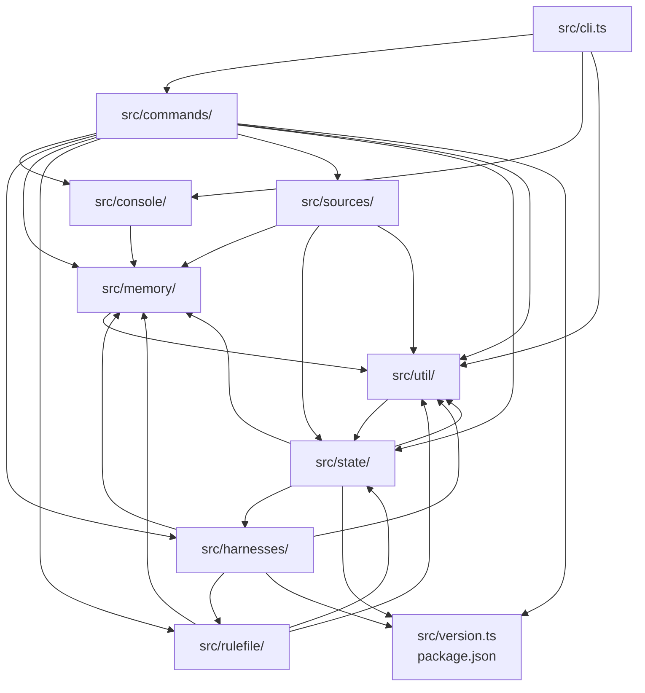
<!-- END GENERATED: architecture-map -->
