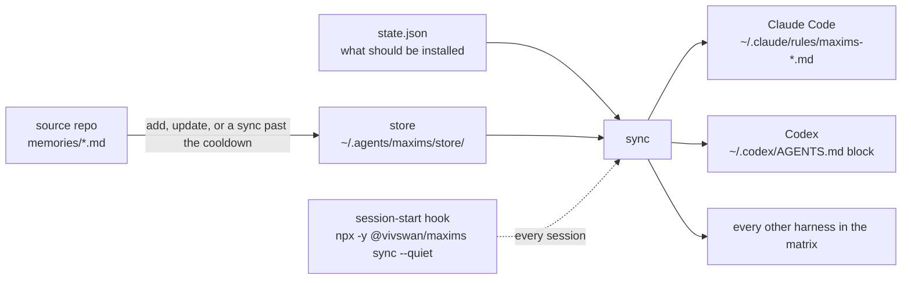

# Why maxims

An agent can hold a rule in its memory and still not act on it, because memory bodies load on recall and recall is probabilistic. maxims puts each rule's one-line summary in the layer the agent loads every session and leaves the body on disk behind a pointer. This page is the reasoning; the [quickstart](quickstart.md) is the commands.

## How it works in one picture



`state.json` is the only record `sync` trusts. A rule file on disk is compared to what it should be, never read back as a record, so the next sync repairs a crash or a hand edit. The [architecture page](architecture.md) shows the same flow as code.

## The rule the agent held but did not act on

The failure that started this tool was a "review before every commit" rule that existed as a memory file while commits went out unreviewed. The memory system had the rule. The session did not.

Before, the rule lived in a memory directory the agent searched only when it judged the memory relevant:

```text
~/.claude/projects/<project>/memory/rubber-duck-before-every-commit.md
   loaded:  when the agent decides to look        (recall, probabilistic)
   result:  a session that never looked committed unreviewed
```

After, the same rule's one-liner sits in the rules layer the harness reads at launch, and the body lives in the store:

```text
~/.claude/rules/maxims-vivswan-skills.md
   - Codex rubber-duck review before EVERY commit, however trivial.
     (detail: ~/.agents/maxims/store/vivswan/skills/rubber-duck-before-every-commit.md)
   loaded:  at every session start                 (guaranteed)
   result:  every session opens already holding the rule
```

The body's content is unchanged; its home is now the store. Only the one line that must always be present changed layers.

## Two layers, one source

```text
 always-loaded layer: the rule file           on-demand layer: the memory body
 +-------------------------------------+      +----------------------------------------+
 | - one-liner A   (detail: .../A.md) |----->| A.md  frontmatter, Why, How to apply   |
 | - one-liner B   (detail: .../B.md) |----->| B.md                                   |
 | - one-liner C   (detail: .../C.md) |----->| C.md                                   |
 +-------------------------------------+      +----------------------------------------+
   read by the harness every session            opened by the agent when it wants detail
```

The one-liner is the memory file's `description` field, and the rule file is generated from it. One field feeds both layers, so there is nothing to drift; the [memory-files page](memory-files.md) owns the file format.

## The npx skills analogy

```text
npx skills             : repo of skills   -> agent's skill dirs   (on-demand workflows)
npx -y @vivswan/maxims : repo of memories -> agent's rules layer  (always-on one-liners)
```

Both install a versioned GitHub repo like a package, with selection, state, and removal; the difference is the target layer.

- **Skill dirs are the probabilistic layer maxims is escaping.** Skills load when invoked or judged relevant.
- **The rules layer is always loaded.** Every harness on the [harnesses page](harnesses.md) has one, and having one is what qualifies it for a row.

Rules also come from reviewable repos instead of hand-copied files, so one machine cannot silently drift from another, and a hook re-syncs them at every session start.

## Prior art

Each tool below already solved part of the problem. The table says what maxims copied from it and what it left behind.

| tool or practice | what it does | what maxims took | what maxims left |
| --- | --- | --- | --- |
| `npx skills` (vercel-labs/skills) | installs `SKILL.md` folders from a GitHub repo into each agent's skills directory, with `add`, `list`, `remove`, and `update`, and a committed `skills-lock.json` a fresh clone replays | the verbs, the flag names and short forms, which the [parity page](parity.md) pins against a captured `skills --help`; the `@owner/repo` shorthand; [`~/.agents/`](state.md#the-canonical-home) as the home; and the committed project lock, which the [project lock](project-lock.md) mirrors | the skills layer itself; maxims adds the rule line in the always-loaded layer and the session-start hook that re-syncs it, which skills do not have |
| Claude Code's `MEMORY.md` index | one index file, loaded every session, with one line per memory that points at the body file beside it | the shape of the two layers, and the [memory file format](memory-files.md) itself, so a source repo needs no new format | the single harness and the single folder; maxims writes the index for every harness in the [matrix](harnesses.md#the-matrix), from a source repo, and leaves Claude Code's own memory folder to Claude Code |
| rulesync (dyoshikawa/rulesync) | compiles rule files under `.rulesync/` into the native rule format of each supported agent when you run `rulesync generate` | the fan-out, one source written in each harness's own format | the unit and the trigger; maxims installs published memories from a repo rather than compiling your own local files, and a hook re-syncs at session start rather than a generate step you run by hand |
| a shell rc line, an OS scheduler, an editor folder-open task, or a git hook | refreshes a file from outside the agent, on a shell start, a clock, an editor open, or a commit | nothing | all four; none fires on the agent's session start, so a session can still open on a stale file, and the [freshness fallbacks decision](design-decisions.md#harnesses) records the rest of the reasons |

## What a rule costs

| item | cost |
| --- | --- |
| one rule line in the rule file | about 25 tokens, loaded every session |
| the memory body | zero tokens until an agent opens the file |
| a source at the default [rule cap](fetching.md#the-cap-and-the-cooldown) | about 600 to 700 tokens |
